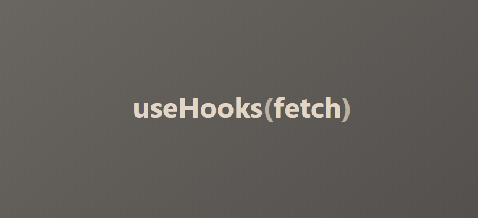

距离上一篇讨论 hooks 的文章已经过了半年了，因为越使用就越发现这个坑不浅。“这段代码写得不好，为什么要放 hooks 很难让人理解。”是我主管在 review 了我使用 hooks 的代码之后说的第一句话。就连发请求这件最简单的事情，我都很难讲清楚为什么要使用 hooks。关于 React Hooks 也看了不少文章，但是始终没找到关于"最简单"的 CRUD 日常实践。所以这期我就抛砖迎玉，说说我目前的粗浅理解。

## 问题

假设有个最简单的需求，`MovieList` 页面需要从服务端获取数据并展示。这里先抛出几个问题：

1. 请求的方法写在哪里？请求来的数据放在哪里？
2. 如果请求还未完成，组件已被 Unmount，有没有做特殊处理?
3. 请求的参数来自哪里，参数变化会触发重新请求吗？调用写在哪里？
4. 请求对应的几个状态: loading，refreshing，error 在组件上处理了么？
5. 如果请求需要轮询，怎么做？有没有处理页面 visibilitychange 的情况？
6. 如果需要在参数变化后重新请求，如果参数频繁更新，会出现竞态（旧的请求因为慢，晚于后发的请求 resolve）的问题吗？

这些都是我觉得在 Class Component 里写“过程式”代码较难解决的问题。有的问题即使使用了 redux 依然没法很方便的处理。所以之前我很喜欢 [Apollo](https://zhuanlan.zhihu.com/p/34238617) 这种把异步数据放在 HOC 自动处理的解决方法。顺便说一下，Apollo 新版 API 推荐的 renderProps 明显更加难用了... 当然 hooks 的版本也已经 beta 了。但当把逻辑彻底放在 HOC 或者 renderProps 里时，如果一个组件依赖于多个请求并且它们之间又有纠缠时，不是特别方便处理。这是因为 HOC 或 renderProps 莫名的建立起了一个本不存在的层级和作用域关系。

那么在 Hooks 里是怎么样的呢？

## useData ?

```js
function useData(dataLoader, params) {
  const [loading, setLoading] = useState(false);
  const [error, setError] = useState(undefined);
  const [data, setData] = useState(undefined);

  useEffect(() => {
    dataLoader().then((responseData) => {
      // ...
      setData(responseData);
    });
  }, [dataLoader, ...params);

  return { data, loading, error };
}

function MovieList({ page, size }) {
  const {
    data: movieListData,
    loading,
    error
  } = useData(
    () => api.queryMovieList({ page, size }),
    [page, size]
  );

  // ...
}
```

第一个想到的是这样一个 Hook，类似于 useEffect，传入获取请求数据的 `dataLoader`，以及这个数据源依的请求参数 `page` 和 `size`。这样看似没问题，但实际上 useEffect 的 dependencies `[dataLoader, ...params]` 无法满足 hook 要求的静态依赖，因为 `useData` 内部无法判断 `...params` 里具体有哪些值。上一章我说 useCallback 一般用于性能，没有必要使用。这里就可以看出来其实说错了...

```jsx
function useData(dataLoader) {
  // ...

  useEffect(() => {
    dataLoader().then((responseData) => {
      // ...
      setData(responseData);
    });
  }, [dataLoader);

  // ...
}


function MovieList({ page, size }}) {
  const queryMovieList = useCallback((page, size) => api.queryMovieList({ page, size }), [page, size]);

  const { data: movieListData, loading, error } = useData(queryMovieList);

  // ...
}
```

这里我们利用 useCallback 将 queryMovieList 和它的参数 page，size 绑定起来。只有在 page 或 size 变化时，queryMovieList 才会更新，然后自动触发 useData 内部的请求逻辑。这样的写法，虽然在组件里多了一次 useCallback 的调用，但是更利于 hook 的静态分析。

有了 `useData` 这样的封装，得益于 hooks 拥有的完整组件生命周期控制，我们可以很容易的将之前提到的组件卸载处理，请求竞态等等的问题，封装在 hooks 中。这里以竞态的问题为例，大致介绍一下可能的方法：

```jsx
function useData(dataLoader) {
  const currentDataLoader = useRef(null);
  // ...

  useEffect(() => {
    currentDataGetter.current = dataGetter;

    dataLoader().then((responseData) => {
      // ...

      // 如果有更新的请求，放弃之前的
      if (currentDataGetter.current !== dataGetter) {
        return;
      }

      setData(responseData);
    });
  }, [dataLoader);

  // ...
}
```

只需要利用 ref 记录下最新的一个 dataLoader，那么在请求 resolve 时就可以判断出是否是过时的数据了。当然以上的代码只是一个示例，还有更多可以调整优化的地方。

## 处理异步状态

以上的 useData 只能解决关于数据获取的那一部分问题，为了处理我们得到的几个状态，不免需要写出这样的代码：

```jsx
function MovieList({ page, size }}) {
  const queryMovieList = useCallback((page, size) => api.queryMovieList({ page, size }), [page, size]);

  const { data: movieListData, loading, error } = useData(queryMovieList);

  if (loading && data == null) {
    return <Spin />
  }

  if (error) {
    return <Exception />
  }

  return (
    <Spin loading={loading}>
      {renderMovieList(movieListData)}
    </Spin>
  );

  function renderMovieList(movieList) {
    return movieList.map(item => <MovieItem key={item.id} data={item} />)
  }
}
```

久而久之我们会发现在所有使用这个 useData 的组件中，我们都避免不了手写这两个 `if`。但是 hooks 只能解决生命周期的问题，没法封装一些 render 的逻辑。其实这里最有效的解决方法就是 Suspense，但是因为还没有发布，所以我们想到了 renderProps:

```jsx
function DataBoundary({ data, loading, error, children }) {
  if (loading) {
    return <Spin />;
  }

  // ...

  return <Spin loading={loading}>{children(data)}</Spin>;
}

function MovieList({ page, size }}) {
  const queryMovieList = useCallback((page, size) => api.queryMovieList({ page, size }), [page, size]);

  const movieListResult = useData(queryMovieList);
  // const { data: movieListData, loading, error } = useData(queryMovieList);

  return (
    <DataBoundary {...movieListResult}>
    // <DataBoundary data={movieListData} loading={loading} error={error}>
      {(data) => renderMovieList(data)}
    </DataBoundary>
  );

  function renderMovieList(movieList) {
    return movieList.map(item => <MovieItem key={item.id} data={item} />)
  }
}
```

在 `DataBoundary` 里，我们封装了关于异步状态处理的渲染流程，还可以提供出类似 fallback 的钩子，满足需要定制化的组件场景。用它做到了类似于 Suspense 的事情。

## All in Hooks？

但是如果我们真的想在 hooks 里完成所有的事情呢？这里再抛出一个彩蛋：

```jsx
function useDataBoundary(dataLoader) {
  // ...

  function boundary(renderChildren) {
    if (loading && data == null) {
      return <Spin />;
    }

    // ...

    return renderChildren(data);
  }

  return boundary;
}

function MovieList({ page, size }}) {
  const queryMovieList = useCallback((page, size) => api.queryMovieList({ page, size }), [page, size]);

  const boundary = useDataBoundary(queryMovieList);

  return (
    <div>
      {boundary((data) => renderMovieList(data))}
    </div>
  );

  function renderMovieList(movieList) {
    return movieList.map(item => <MovieItem key={item.id} data={item} />)
  }
}
```

如果我们可以在 hooks 中返回一个 "renderProp"，我们就可以完整的将 render 相关的逻辑也封装在 hooks 里了，但是同时这样也会使得一个 hook 里的代码变得复杂，这里只是提供一种思路。那么这两种写法你更喜欢那个呢？

## 尾巴

这篇文章大致说明了在使用 hooks 写业务逻辑时的一点思考。很多地方没有详细展开，大家如果有兴趣的话可以再深入讨论。至少在最开始提出的几个问题上，hooks 帮我解决了这些原本没有地方安置的抽象逻辑。所以虽然我还是经常遇到 deps 没考虑清楚导致死循环的请求，我依然觉得 hooks 值得一试~
