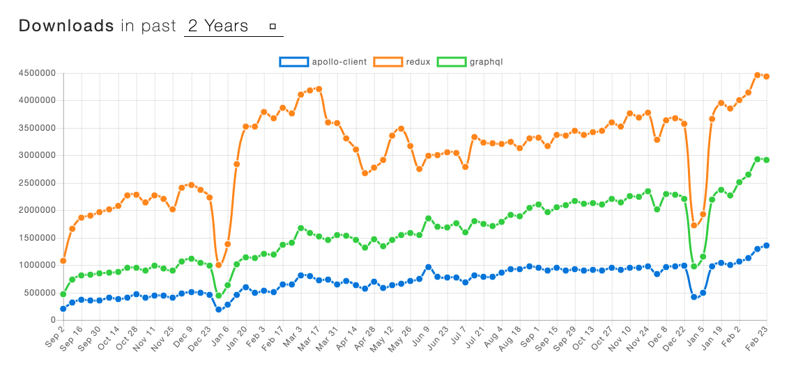
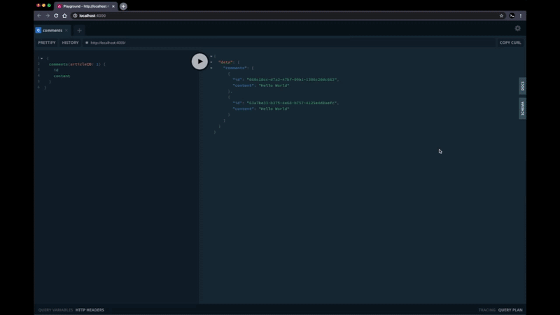
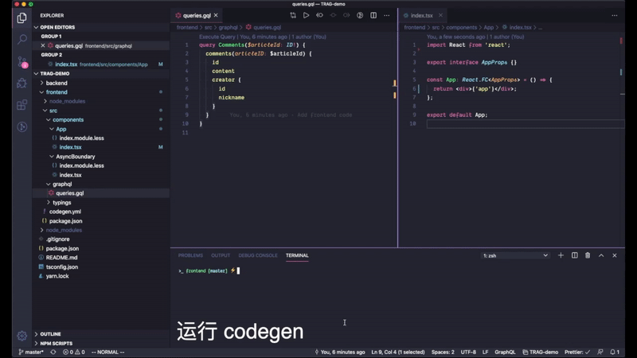

两年前我在 [介绍 GraphQL 和 Apollo 的文章里](https://zhuanlan.zhihu.com/p/34238617) 预测 ”它将在 2018 年崛起“。然而转眼已经 2020 了，GraphQL 和 Apollo 并没能迎来突破。



## 工作流

虽然预测的不准，但是并不影响我们这两年继续在团队内实践和推广 GraphQL。从去年开始，我们又在新的业务项目中完整使用了 GraphQL + TypeScript + React + Apoolo 的技术栈。这篇文章依然是我作为一个水平较浅的前端，想要整理一下这段时间的工作流。

为了能更直观的展示，我还是假设一个实际开发可能碰到的需求，下图摘自是上篇文章下知乎的评论区，让我们从零实现这个评论展示的需求吧。


## 1. 约定接口

接到需求后的第一步，是定义数据的接口，当然也有可能是直接看后端大哥丢过来的接口文档。不同于其他接口定义方式的松散（各种文档工具，或者只是存在于钉钉聊天记录里），我们会将 GraphQL 的接口 Type 明确的定义在 git 仓库中，这样可以享受到 git 天生的历史回溯和版本管理。我们最希望的方式是前后端坐在一起，边喝咖啡边商量好这样的 GraphQL 类型文件

```ts
type CommonUserRef {
  # 用户 ID
  id: ID!
  # 昵称
  nickname: String!
  # 头像的图片链接
  avatar: String!
  #
}

type Comment {
  # 评论 ID
  id: ID!
  # 评论内容
  content: String!
  # 评论创建者
  creator: CommonUserRef!
  # 评论回复的用户
  replyTo: CommonUserRef
  # 是否为文章作者
  isAuthor: Boolean!
  # 评论创建时间
  gmtCreate: DateTime!
  # 点赞数
  likes: Int!
  # 相关回复评论
  replyComments: [Comment!]!
}

type Query {
  # >_ 假设我们无头无尾的就是需要取这些评论
  # 评论列表
  comments(articleID: ID!): [Comment!]!
}
```

喝咖啡的时候，必须再吐槽一下 GraphQL 类型中 non-nullable 使用 `!` 的设计。实际业务中大部分字段都会有明确的限制，TypeScript 中使用 `?` 更加方便，默认非空的思维方式应该也会更利于接口的设计。我们花五分钟定完了接口，顺带写上了点注释，commit push 一气呵成。

## 2. Codegen

走回我们的座位上，打开熟悉的 GraphQL Playground，发现后端大哥都已经部署好了我们新添加的 Schema 和测试数据，这么快！我们直接在 GraphQL Playground 里边写边测试前端的查询语句。



```ts
query Comments($articleID: ID!) {
  comments(articleID: $articleID) {
    id
    content
    creator {
      id
      nickname
    }
  }
}
```

借助于类型系统，我们不难对照着 GraphQL 的 query 语句和 Schema 类型写出对应的查询结果类型：

```ts
interface Comments {
  comments: Array<{
    id: string;
    content: string;
    creator: {
      id: string;
      nickname: string;
    };
  }>;
}
```

正因如此，社区里诞生了大量根据 GraphQL Schema 自动生成样板代码的工具，比如 [graphql-code-generator](https://graphql-code-generator.com/)，[apollo-tooling:codegen](https://github.com/apollographql/apollo-tooling#apollo-clientcodegen-output)，[graphqlgen](https://github.com/prisma-labs/graphqlgen)。这里以目前最热门的 graphql-code-generator 为例，展示一下大致的思路：

在项目中需要定义 codegen 相关的配置：

```yaml
# 日常环境
schema: http://daily.example.com/graphql
documents: 'src/**/*.gql'
generates:
  src/generated/graphql.tsx:
    plugins:
      - typescript
      - typescript-operations
      - typescript-react-apollo
    config:
      withHooks: true
```

然后运行 graphql-codegen 命令，generator 会读取日常环境中后端服务器的 Schema，以 `src` 下所有的 `gql` 文件为输入，向 `generated/graphql.tsx` 中输出所有的相关查询类型及 React hooks。这样，在需要调用数据的 React 组件中，通过代码提示，我们只需要敲几个字母就可以得到 **强类型** 的查询 hooks 和类型。

不仅前端代码遍写时能享受到强类型带来的好处。GraphQL 同样可以在服务端校验请求和响应中的数据类型，这意味着你拥有了开发时和运行时的类型双保险，妈妈再也不用担心 `Cannot read property of null` 的问题啦。



## 3. Hooks & Components

前端的请求查询框架，我们使用 [@apollo/react-hooks](https://www.apollographql.com/docs/react/data/queries/)，配合上上一步生成的接口 hooks，可以直接写出这样的组件：

```tsx
const App: React.FC<AppProps> = () => {
  const { data, loading, error } = useCommentsQuery({
    variables: {
      articleId: '1',
    },
  });

  if (loading) return null;
  if (error) return <div>Error! {error}</div>;

  return (
    <div>
      {data
        ? data.comments.map((item) => <div key={item.id}>{item.content}</div>)
        : null}
    </div>
  );
};
```

稍稍有一些繁琐，针对 `loading`, `error` 的状态，以及 `data` 字段 nullable 的管理，可以封装一个类似 `AsyncBoundary` 的组件：

```ts
interface AsyncBoundaryProps<T = unknown> {
  loading?: boolean;
  error?: Error;
  data: T;
  // ...
}

// ...
function render() {
  if (this.props.loading) {
    return onLoading();
  }

  if (this.props.error) {
    return onError();
  }

  if (data == null) {
    return null;
  }

  return children(data as NonNullable<T>);
}
```

这样，组件中可以稍稍优化成：

```tsx
const App: React.FC<AppProps> = () => {
  const commentsResult = useCommentsQuery({
    variables: {
      articleId: '1',
    },
  });

  return (
    <AsyncBoundary {...commentsResult}>
      {(data) =>
        data.comments.map((item) => <div key={item.id}>{item.content}</div>)
      }
    </AsyncBoundary>
  );
};
```

## 4. 部署上线

前端的故障往往来自于自身的发布或接口的变动，而基于 GraphQL 的工作流在这一点上也能有所优化。依然是借助于 Codegen，在代码发布上线前我们可以指定线上的 schema 重新运行一遍 codegen，再根据生成的查询代码重新编译打包，这样相当于对所有使用到的字段重新做了针对线上接口的类型检查。如果有字段从 CommonUser! 变成了 CommonUser，会触发编译错误。

```json
// - codegen.daily.yaml
// - codegen,prod.yaml
//
// - package.json
{
  // ...
  "scripts": {
    "codegen:prod": "graphql-codegen --config ./codege.prod.yaml",
    "prePublish": "yarn codegen:prod && yarn build:prod"
  }
}
```

## 尾巴

为了方便团队里还未使用过 GraphQL 和 Apollo 的同学快速熟悉，整理了这篇文章。多次提到的后端大哥，其实才是整个 GraphQL 技术栈最重要的依赖。GraphQL 诞生已经 8 年了，不敢再说它是 API 查询的未来。TypeScript 在这两年发展飞速，而 graphql-codegen 这样的工具也搭上这趟车，给前端开发带来更好的体验。在这样的思路下，如果使用的是 REST 但是有一定格式的接口文档，是不是也能有所启发呢？React Conf 2019 上 [Using Hooks and Codegen | Tejas Kumar
](https://www.youtube.com/watch?v=cdsnzfJUqm0&t=1125s) 的分享或许能帮到你。
